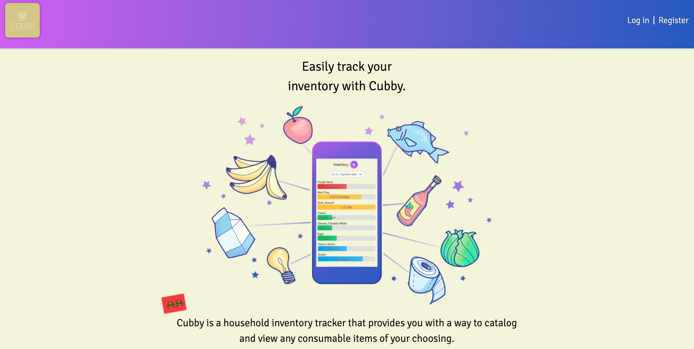
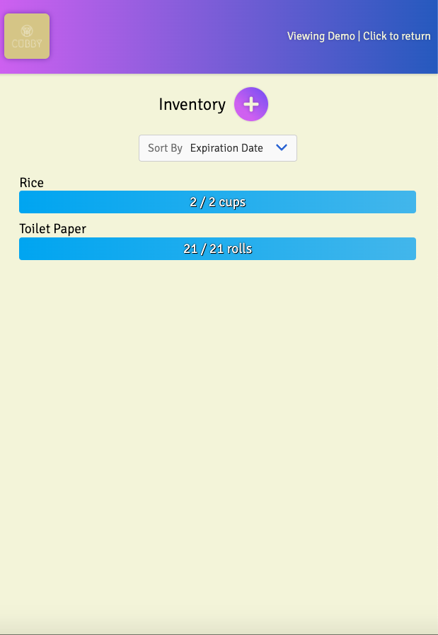

# Cubby (Client)

**Cubby is a household inventory tracker.**

- [Link to live app](https://cubby.gjames5355.vercel.app/)
- [Link to server code]()

> Landing Page (Desktop)

## Purpose

I have downloaded and used countless shopping list, pantry organizer, fridge helper, and related apps but could never find one that could get the job done. They either were plagued by unintuitive UI/UX experience, or even worse, they were bloated with tons of excess features that over-complicate the already stressful task of managing the items in your house.

I just wanted something simple and elegant that showed me how much of something is left and when it was going to expire, _at a glance_.

The core philosophy that I stuck to when designing the user-facing view of Cubby was to show only as much as needed, and nothing more.

> Inventory Page (Mobile)

## Features

- Add or delete named, consumable items from inventory.
- Increase or decrease item quantities, shown with progress bars.
- Set the expiration date on an item and its progress bar will change colors based on how close it is to expiring.
- Sort items by expiration date, name, or quantity.
- Access user account from any device.

## Tech Stack

_React, Node, Express, PostgreSQL, Mocha/Chai, Jest/Enzyme, HTML5, CSS3_
